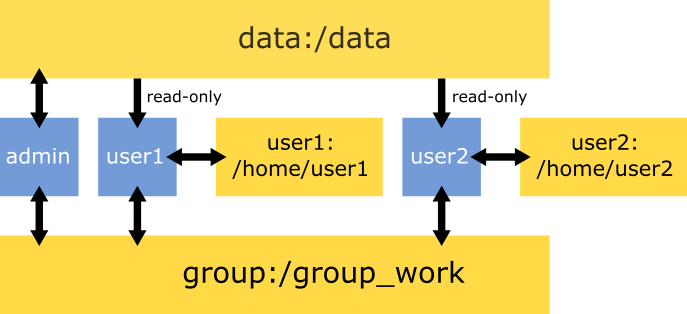

# AWS-docker

Scripts to employ multiple docker containers simultaneously for teaching.

## Preparation

Install docker on AWS (e.g. on an ubuntu image):

```sh
curl https://get.docker.com | sh
sudo usermod -a -G docker ubuntu
sudo service docker start
```

You can add the above code to the code run at initialisation. Otherwise, logout and login again to be able use `docker` without `sudo`.

Also install python3, pip and jupyter_server:

```sh
sudo apt-get update
sudo apt-get install -y python3-pip
pip3 install jupyter_server
```

Clone this repository:

```sh
git clone https://github.com/GeertvanGeest/AWS-docker.git
```

## Deploying containers

Prepare a tab-delimited user list with three columns: port, username and password. E.g.:

```
10001	user01	pwusera
10002	user02	pwuserb
```

Once deployed, the jupyter notebook or rstudio server will be available through `[HOST IP]:[PORT]`.

### Deploy containers based on jupyter notebook

Prepare an image that you want to use for the course. This image should be based on a jupyter notebook container, e.g. [jupyter/base-notebook](https://jupyter-docker-stacks.readthedocs.io/en/latest/using/selecting.html#jupyter-base-notebook), and should be available from `dockerhub`.

Run the script `run_jupyter_notebooks`:

```sh
run_jupyter_notebooks \
-i jupyter/base-notebook \
-u examples/user_list_test.txt \
-p test1234
```

### Deploy containers based on Rstudio server

Prepare an image that you want to use for the course. This image should be based on a rocker , e.g. [rocker/rstudio](https://hub.docker.com/r/rocker/rstudio), and should be available from `dockerhub`.

Run the script `run_rstudio_server`:

```sh
run_rstudio_server \
-i rocker/rstudio \
-u examples/user_list_test.txt \
-p test1234
```

The username to log on to rstudio server is `rstudio`.

## Restricting resource usage

To prevent overcommitment of the server, it can be convenient to restrict resource usage per participant. You can do that with the options `-c` and `-m`, which are passed to the arguments `--cpus` and `--memory` of `docker run`. Use it like this:

```sh
run_rstudio_server \
-i rocker/rstudio \
-u examples/user_list_test.txt \
-p test1234 \
-c 2 \
-m 4g
```

Resulting in a hard limit of 2 cpu and 4 Gb of memory for each user. By default these are 2 cpu and 16 Gb of memory. These restrictions are not applied to the admin container.

## Container & volume infrastructure

Below you can find an example of the container infrastructure. Blue squares are containers, yellow are volumes. Arrows indicate accessibility. The data volume is meant to harbour read-only data (e.g. raw data). The group volume is meant as a shared directory, where everybody can read and write.



## How to use admin privileges

The admin container (i.e. with sudo rights) is available from port 10000 for the jupyter containers and 9000 for the rstudio containers. The regular users at the ports specified in the tab-delimited text file.

You can check out a user volume with `mount_user_volume.sh`:

```sh
./mount_user_volume.sh user01
```

This will create an ubuntu container directly accessing the home directory of user01.  

## Stopping services

You can stop all services (containers and volumes) with the script `stop_services.sh`.
